# pace

**A self-hosted dashboard for feeds, repos, papers, videos, and links.**

Pace collects content from Hacker News, RSS, GitHub, Lemmy, Mastodon, YouTube, arXiv, npm, Wikipedia, podcasts, Product Hunt, and more. You configure sources, transforms, ranking, summaries, and layout in YAML. It runs as one Bun process or Docker container.

<p align="center">
  <a href="https://www.youtube.com/watch?v=UElmyC06ryM"></a>
</p>

<p align="center">
  <a href="https://www.youtube.com/watch?v=UElmyC06ryM"><strong>Watch the 2-minute demo</strong></a>
  ·
  <a href="#presets">Presets</a>
  ·
  <a href="#get-started">Get started</a>
  ·
  <a href="#share-a-snapshot">Share a snapshot</a>
  ·
  <a href="#example-dashboards">Examples</a>
</p>

## Why Pace

- **One dashboard** - combine feeds, repos, releases, papers, videos, podcasts, metrics, and hand-picked links.
- **Filtering and ranking** - filter, exclude, dedupe, time-decay, cluster, keyword-score, and optionally use an LLM to summarize, filter, merge, or rank items.
- **Flexible layout** - arrange panels, counters, markdown, images, and iframes with a recursive flexbox layout.
- **Portable output** - server-rendered HTML, SQLite storage, no client-side JavaScript, and static snapshots you can export or publish through Gist.
- **Agent-readable config** - bundled skills document setup and configuration workflows for coding agents.

## Presets

#### Preset showcase

| | | | |
|:---:|:---:|:---:|:---:|
| [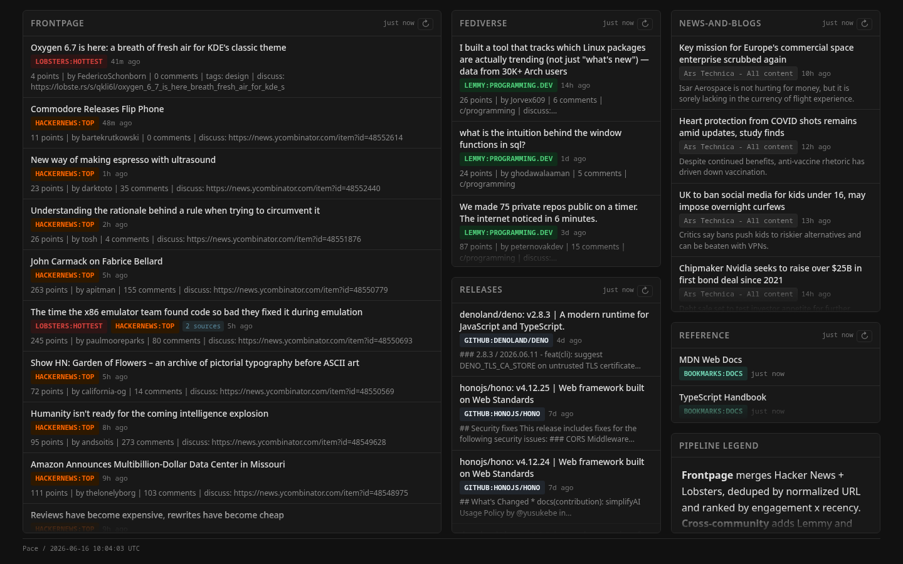](./presets/config.tech-news.yaml) | [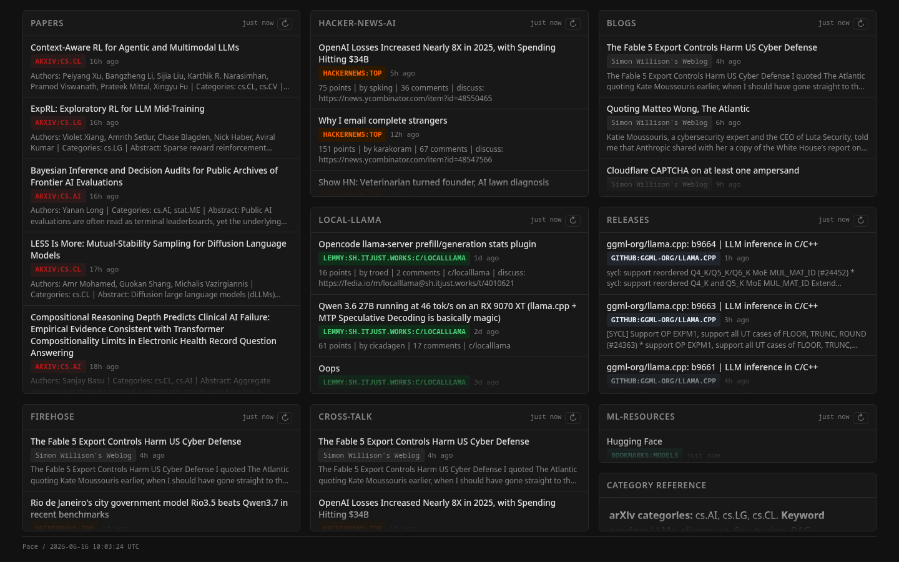](./presets/config.ml-ai.yaml) | [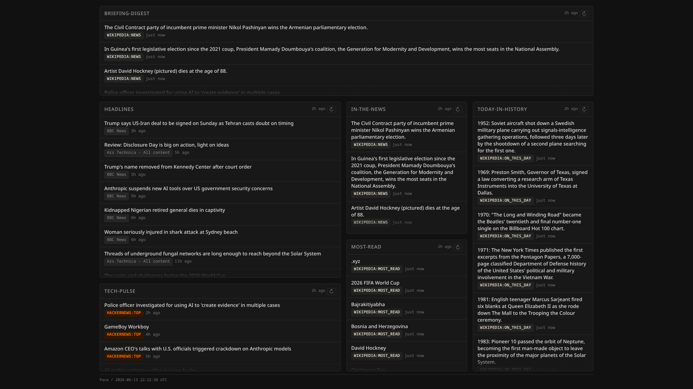](./presets/config.daily-brief.yaml) | [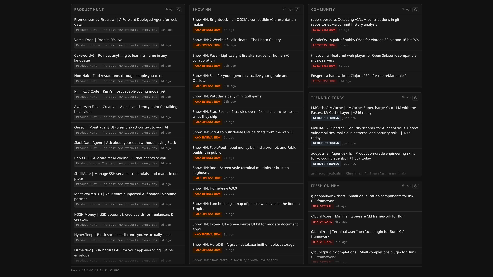](./presets/config.product-launches.yaml) |
| [`tech-news`](./presets/config.tech-news.yaml) | [`ml-ai`](./presets/config.ml-ai.yaml) | [`daily-brief`](./presets/config.daily-brief.yaml) | [`product-launches`](./presets/config.product-launches.yaml) |
| [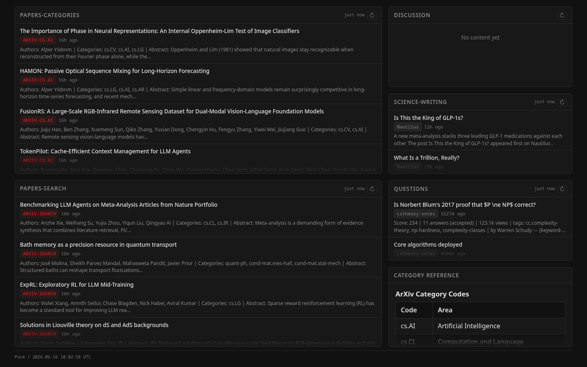](./presets/config.academic-papers.yaml) | [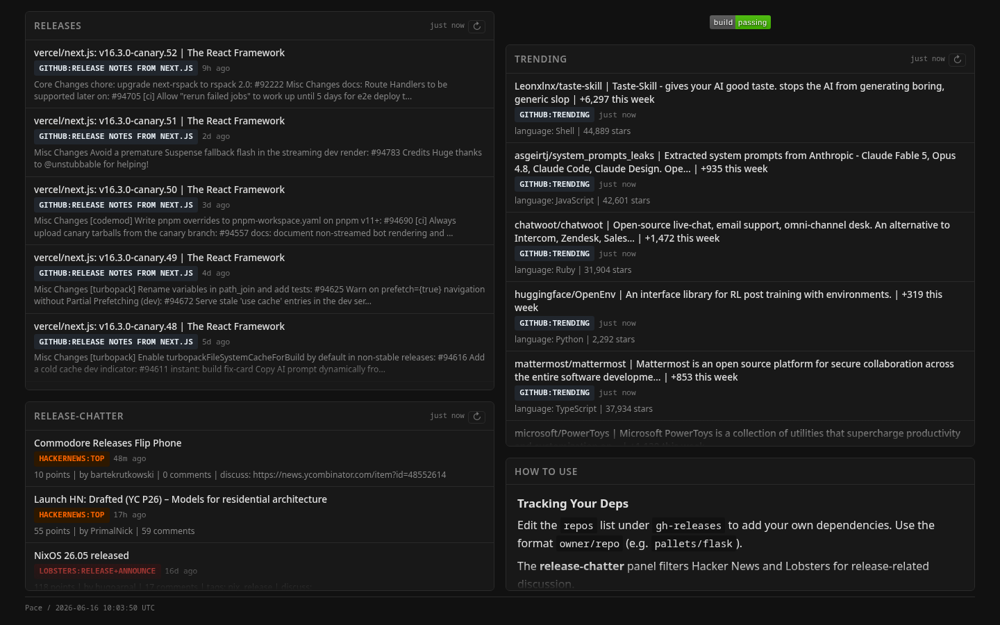](./presets/config.release-tracker.yaml) | [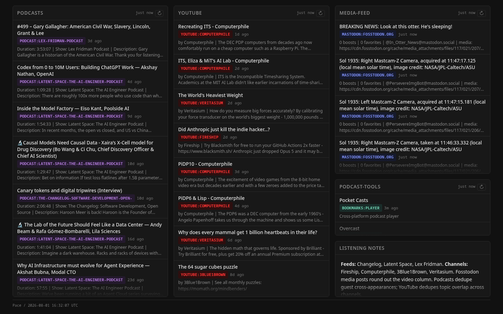](./presets/config.video-podcast.yaml) | |
| [`academic-papers`](./presets/config.academic-papers.yaml) | [`release-tracker`](./presets/config.release-tracker.yaml) | [`video-podcast`](./presets/config.video-podcast.yaml) | |

Presets are bundled in the Docker image and selectable with a single flag (`--preset tech-news` or `-P ml-ai`; see `pace --list-presets`).

Available presets:

| Preset | Focus |
|--------|-------|
| `tech-news` | Tech news: HN + Lobsters frontpage, Lemmy communities, news/blogs, releases |
| `ml-ai` | AI and machine learning: arXiv papers, local-LLM community, releases, curated blogs |
| `daily-brief` | Morning briefing: world headlines, Wikipedia in-the-news/most-read, big HN stories |
| `product-launches` | Product launches: Product Hunt, Show HN, trending repos, fresh npm packages |
| `release-tracker` | Software release tracking |
| `academic-papers` | Academic papers: arXiv, CS theory Q&A, science journalism |
| `video-podcast` | Video and podcast content |

List presets: `pace presets list` (or `pace --list-presets`).

## Get Started

### Recommended: agent skills

If you use a coding agent, install the bundled skills so it can follow the local setup commands and config schema. The skills cover installing Pace, running a preset, creating `config.yaml`, adding feeds, tuning transforms, and publishing a static snapshot.

```bash
npx skills add av/pace --skill pace-setup
npx skills add av/pace --skill pace-config
```

List all available skills: `npx skills add av/pace --list`.

Agents working inside the repo can read the same skills through the CLI:

```bash
git clone https://github.com/av/pace.git && cd pace
bun install && npm link

pace skill
pace skill pace-setup
pace skill pace-config
```

The Docker image also ships skills: `docker run --rm ghcr.io/av/pace pace skill`.

### Secondary: Docker

```bash
docker run -d -p 7453:7453 -v pace-data:/app/data ghcr.io/av/pace:latest
```

Open http://localhost:7453. Health check: `curl http://localhost:7453/health` returns `{"status":"ok"}`.

### With a preset

Use `--preset` (or `-P`) with Docker or source commands, for example `--preset tech-news`. See the "## Presets" section for the full list.

### Secondary: from source

```bash
git clone https://github.com/av/pace.git && cd pace
bun install && npm link
pace serve --preset tech-news
```

Before `npm link`, use `bun run src/cli.ts ...` instead of `pace ...`.

### Secondary: your own config

```bash
curl -O https://raw.githubusercontent.com/av/pace/main/config.example.yaml
mv config.example.yaml config.yaml
# edit config.yaml
pace config check config.yaml
pace serve --config config.yaml
```

## Custom Docker Config

```bash
curl -O https://raw.githubusercontent.com/av/pace/main/config.example.yaml
mv config.example.yaml config.yaml
# edit config.yaml
docker run -d \
  -p 7453:7453 \
  -v pace-data:/app/data \
  -v ./config.yaml:/app/config.yaml:ro \
  ghcr.io/av/pace:latest
```

Validate before serving: `pace config check config.yaml`

## Share a Snapshot

Pace can turn the current dashboard into static files, so you can share a dashboard without exposing or operating a public pace server.

```bash
pace share export pace-share
```

That writes `pace-share/index.html` and `pace-share/styles.css` for local review or manual upload.

Publish the same snapshot to GitHub Gist and get a browser-rendered URL:

```bash
GITHUB_TOKEN=... pace share gist
```

Useful options:

- `--gist-id <id>` or `--update <id>` updates an existing Gist so the share URL stays stable.
- `--public` creates a public Gist; the default is secret/unlisted.
- `--renderer-url <url>` switches from the default `https://gisthost.github.io/` renderer to another compatible Gist renderer.

Static snapshots are read-only: refresh controls and server-only routes are omitted, and unresolved environment placeholders are rejected instead of being published.

## Built-in content adapters

Pace ships with 19 adapters: `hackernews`, `rss`, `github`, `github-releases`, `lobsters`, `youtube`, `arxiv`, `mastodon`, `npm`, `wikipedia`, `lemmy`, `devto`, `stackexchange`, `producthunt`, `podcast`, `bookmarks`, `counter`, `reddit`, and `twitter`.

Use `bookmarks` for curated links that live directly in config. Use `counter` for numeric JSON endpoints rendered as stat cards. Every ingest adapter can have its own `refresh_interval`.

See skills/pace-config/SKILL.md for the full adapter table.

### Caveats

Some adapters are listed above but do not work out of the box:

- **`reddit`** - Reddit's public unauthenticated `.json` API often returns **HTTP 403** upstream. Bundled presets intentionally omit Reddit for this reason. For community discussions without credentials, use **`lemmy`** instead (included in the `tech-news` and `ml-ai` presets).
- **`twitter`** - Requires `bearer_token` in adapter params. Without it, the adapter **always returns an empty list** (no error). Run `pace adapters explain twitter` for setup details.

```bash
pace adapters list            # list all adapter types
pace adapters explain <type>  # show params and example
pace config check [path]      # validate a config file
```

## Transforms

Transforms process content after fetching - filter, deduplicate, rank, or enrich items before they reach the dashboard.

| Transform | What it does |
|-----------|-------------|
| `latest` | Keep the N most recent items |
| `filter` | Include items matching keywords |
| `exclude` | Remove items matching keywords |
| `sort` | Sort by field (score, date, title) |
| `dedupe` | Deduplicate by URL, domain, or title similarity |
| `time-decay` | Blend engagement with recency using configurable half-life |
| `keyword-score` | Score items by weighted keyword/regex matches |
| `cluster` | Group related stories across sources |
| `llm-summarize` | Summarize items with an LLM (optionally fetches full page content) |
| `llm-filter` | Keep only items matching interests, scored by LLM |
| `llm-rank` | Rank items 0-10 by relevance to your interests |
| `llm-merge` | Merge and deduplicate using LLM understanding |

`pace transforms list` shows all transform types. `pace transforms explain <type>` shows parameters and examples.

## Pipelines

Pipelines merge items from multiple adapters, then apply transforms to the combined feed. Useful for cross-source deduplication and unified ranking.

For example, one panel can merge Hacker News, Lobsters, and RSS, dedupe repeated links, rank by your interests, and summarize the winners before rendering.

## Layout

Arrange panels in a recursive flexbox tree. Each node is a flex container, a panel, or a widget.

Panels display adapters or pipelines. Widgets display static images, text/markdown, sanitized HTML, iframes, or stat-card counters. Responsive layouts collapse to a single column on mobile below 768px.

See skills/pace-config/SKILL.md for the layout reference.

## LLM integration (optional)

Connect any LLM provider via [pi-ai](https://github.com/badlogic/pi-mono) to power the `llm-*` transforms. Works with OpenAI, Anthropic, Google, Groq, Mistral, and any OpenAI-compatible endpoint. Gracefully degrades when unconfigured.

Define your interests once; `llm-rank` and `llm-filter` use them by default. Without an LLM, the same adapters, transforms, layouts, and static sharing flow still work.

See skills/pace-config/SKILL.md for the llm reference.

## Example Dashboards

These are reference dashboards: useful for seeing what pace can express, studying layout patterns, and adapting a config by hand. For ready-to-run starting points, use Presets.

| | | | |
|:---:|:---:|:---:|:---:|
| [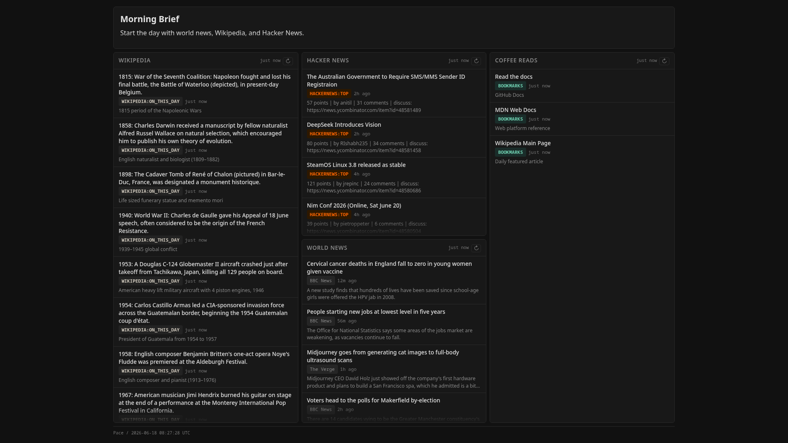](./examples/morning-brief.yaml) | [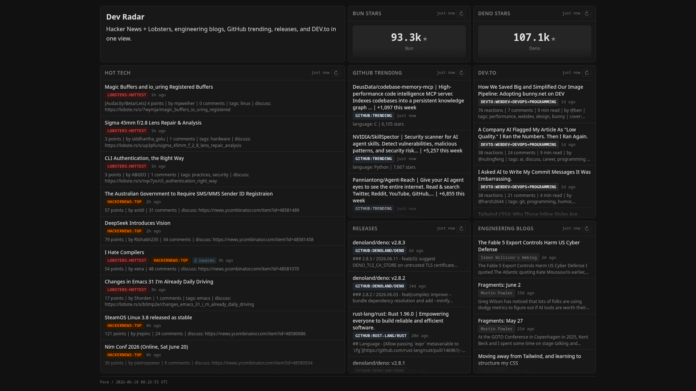](./examples/dev-radar.yaml) | [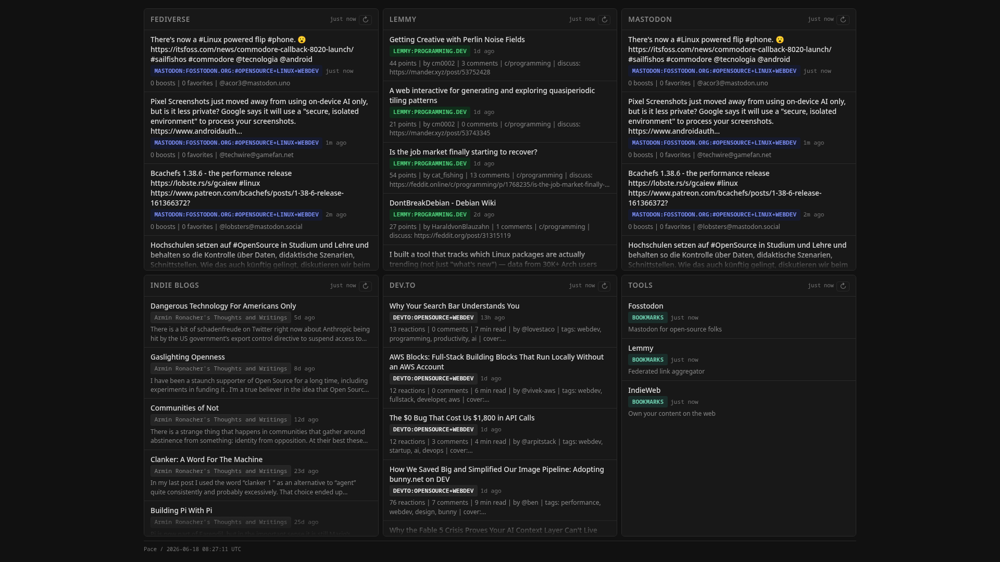](./examples/indie-web.yaml) | [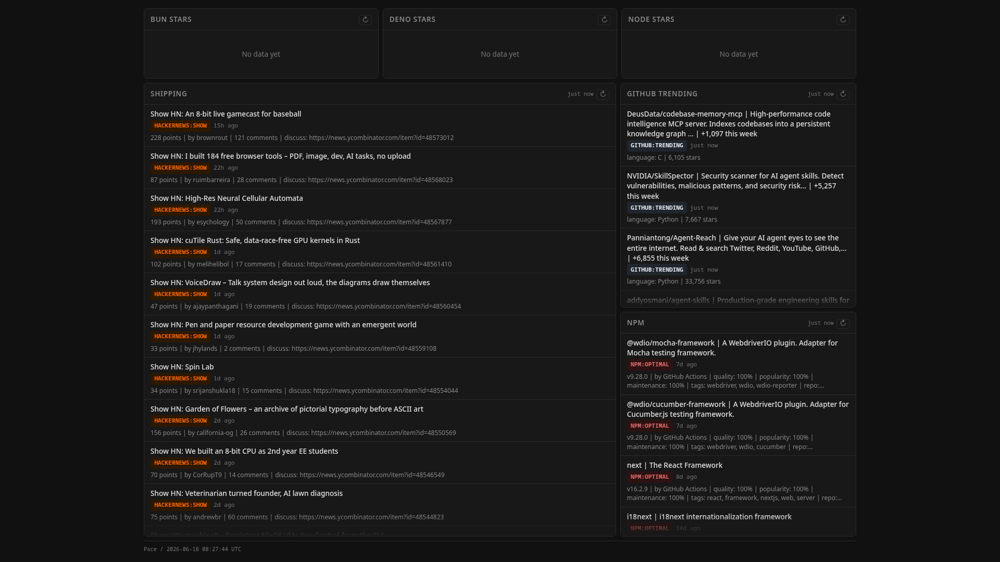](./examples/open-source-launchpad.yaml) |
| [Morning Brief](./examples/morning-brief.yaml) | [Dev Radar](./examples/dev-radar.yaml) | [Indie Web](./examples/indie-web.yaml) | [Open Source Launchpad](./examples/open-source-launchpad.yaml) |
| [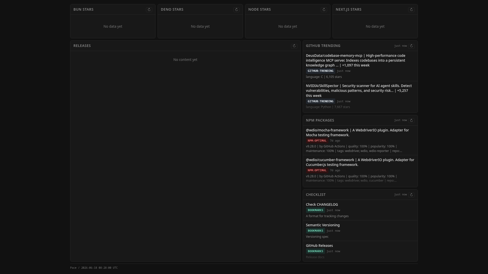](./examples/release-cockpit.yaml) | [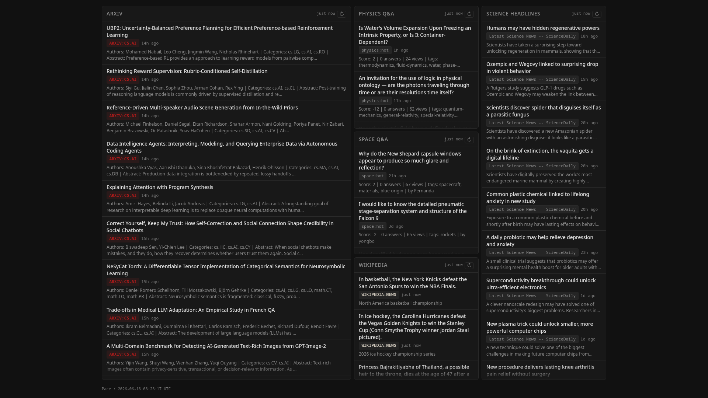](./examples/science-desk.yaml) | [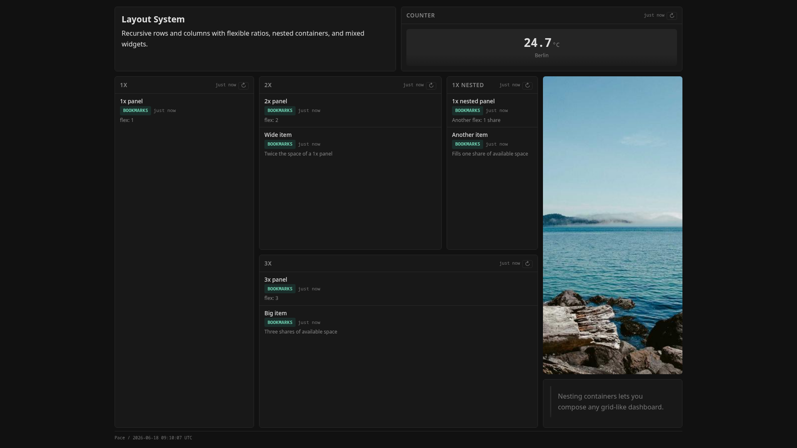](./examples/layout-system.yaml) | [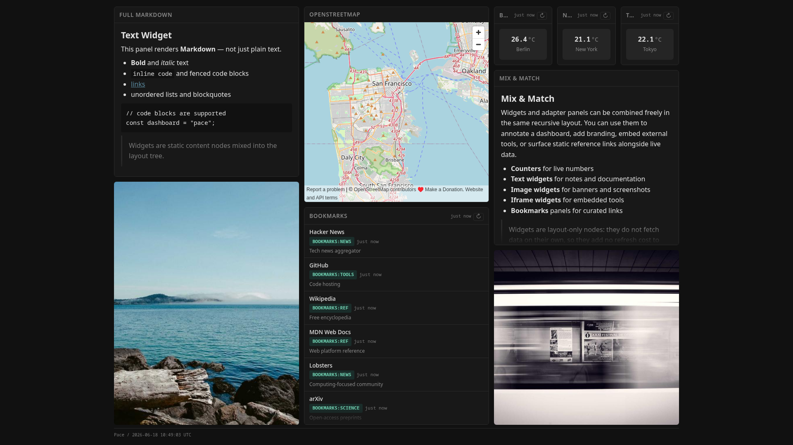](./examples/widgets-gallery.yaml) |
| [Release Cockpit](./examples/release-cockpit.yaml) | [Science Desk](./examples/science-desk.yaml) | [Layout System](./examples/layout-system.yaml) | [Widgets Gallery](./examples/widgets-gallery.yaml) |

<p align="center">Example layouts above. Use the paths in Get Started to run pace with agent skills, Docker, or source.</p>

## For agents

See [Get Started](#get-started): humans install skills with `npx skills add av/pace`; agents clone pace and use `pace skill`. The [`examples/`](examples/) directory pairs screenshots with reference configs to study when writing `config.yaml`.

## Tech stack

Bun + Hono + SQLite + JSX server rendering. No client-side JavaScript.

## License

MIT
