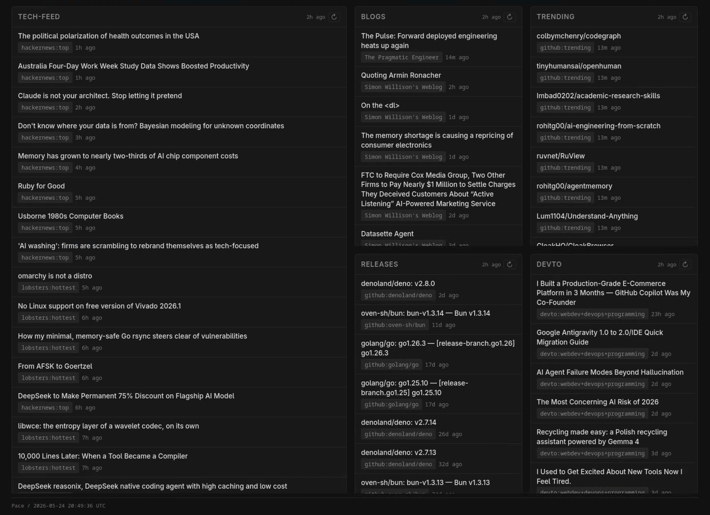

# Pace

**Self-hosted news aggregator and personal content dashboard.**



Aggregate Hacker News, Reddit, RSS, GitHub, Mastodon, YouTube, arXiv, and 10 more sources into a single dashboard you own. Filter, deduplicate, score, and optionally use an LLM to summarize and rank what matters to you. Everything runs in a single Docker container with zero client-side JavaScript.

- **17 built-in sources** — Hacker News, Reddit, RSS/Atom, GitHub, Mastodon, YouTube, arXiv, npm, Wikipedia, Lemmy, and more
- **Configurable in YAML** — adapters, transforms, layout, and LLM settings in one file
- **Self-hosted in one command** — `docker run` and you're done, SQLite for persistence
- **Optional AI-powered filtering** — LLM summarization, ranking, and filtering via any OpenAI/Anthropic/Google/Groq provider
- **No client-side JavaScript** — server-rendered HTML, fast on any device

## Quick start

```bash
docker run -d -p 7453:7453 -v pace-data:/app/data ghcr.io/av/pace:latest
```

Open http://localhost:7453 — the default config ships with Hacker News, Lobsters, GitHub trending/releases, engineering blogs, and DEV.to.

### With a preset

```bash
docker run -d -p 7453:7453 \
  -v pace-data:/app/data \
  ghcr.io/av/pace:latest --preset tech-news
```

Or locally: `pace --preset tech-news` (or `pace -P ml-ai`). See `pace --list-presets`.

### Custom config

```bash
curl -O https://raw.githubusercontent.com/av/pace/main/config.example.yaml
mv config.example.yaml config.yaml
# edit config.yaml with your feeds

docker run -d -p 7453:7453 \
  -v ./config.yaml:/app/config.yaml:ro \
  -v pace-data:/app/data \
  ghcr.io/av/pace:latest
```

### From source

```bash
git clone https://github.com/av/pace.git && cd pace
bun install
bun run dev
```

## Built-in content adapters

Pace ships with 17 adapters that pull content from public APIs. Each adapter has a `refresh_interval` in minutes (default: 15).

| Adapter | Source | Key params |
|---------|--------|------------|
| `hackernews` | Hacker News front page, Ask HN, Show HN, jobs | `feed` (top/new/best/ask/show/job), `limit`, `min_score` |
| `reddit` | Subreddit posts | `subreddits`, `sort`, `limit`, `min_score` |
| `rss` | Any RSS or Atom feed | `urls` |
| `github` | GitHub trending repos or releases | `mode` (trending/releases), `repos`, `language`, `since` |
| `github-releases` | Track new releases for specific repos | `repos`, `token` |
| `lobsters` | Lobste.rs stories by feed or tag | `feed` (hottest/newest), `limit`, `min_score`, `tags` |
| `mastodon` | Mastodon public timeline, hashtags, or accounts | `instance`, `hashtags`, `accounts`, `limit` |
| `youtube` | YouTube channel and playlist feeds | `channels`, `playlists`, `limit` |
| `devto` | DEV.to articles by tag or author | `tags`, `username`, `top`, `limit`, `min_reactions` |
| `arxiv` | Academic papers from arXiv | `categories`, `query`, `limit` |
| `stackexchange` | StackOverflow and other SE sites | `site`, `tags`, `sort`, `min_score` |
| `wikipedia` | Featured articles, most-read pages, on-this-day, current news | `mode` (most_read/featured/on_this_day/news), `language`, `limit` |
| `lemmy` | Posts from any Lemmy instance | `instance`, `communities`, `sort`, `limit`, `min_score` |
| `npm` | npm package search by keyword, scope, or popularity | `keywords`, `scope`, `sort` (optimal/quality/popularity/maintenance), `limit` |
| `producthunt` | Product Hunt launches | `limit`, `min_upvotes`, `enrich` |
| `podcast` | Podcast episodes from RSS feeds | `feeds`, `limit` |
| `twitter` | Twitter/X lists and searches | `lists`, `searches` |

## Ingest-time transforms

Transforms process content after fetching — filter, deduplicate, rank, or enrich items before they reach the dashboard.

`latest` `filter` `exclude` `sort` `dedupe` `time-decay` `keyword-score` `cluster` `llm-summarize` `llm-filter` `llm-rank` `llm-merge`

See `config.example.yaml` for full options.

## Dashboard layout

Arrange panels in a recursive flexbox tree defined in YAML. Each panel displays content from an adapter or pipeline.

```yaml
layout:
  direction: row
  children:
    - panel: news
      source: hackernews
      flex: 2
    - direction: column
      flex: 1
      children:
        - panel: blogs
          source: rss
        - panel: releases
          source: gh-releases
```

Responsive — collapses to a single column on mobile (below 768px).

## LLM-powered content filtering (optional)

Connect any LLM provider via [pi-ai](https://github.com/badlogic/pi-mono) to summarize, filter, rank, or merge content based on your interests. Works with OpenAI, Anthropic, Google, Groq, Mistral, and more. Gracefully degrades when unconfigured — no LLM required to use Pace.

```yaml
llm:
  provider: openai
  model: gpt-4o-mini
  api_key: ${OPENAI_API_KEY}
  interests: [systems programming, web development]
```

## Presets

Presets are bundled in the Docker image and selectable with a single flag (`--preset tech-news` or `-P ml-ai`; see `pace --list-presets`). Ready-to-use configurations for common use cases:

| Preset | Focus |
|--------|-------|
| `config.example.yaml` | General software engineering (HN, Lobsters, GitHub, blogs, DEV.to) |
| `config.tech-news.yaml` | Tech news from multiple sources |
| `config.ml-ai.yaml` | AI and machine learning research |
| `config.product-launches.yaml` | Product launches and startup news |
| `config.release-tracker.yaml` | Software release tracking |
| `config.academic-papers.yaml` | Academic paper aggregation |
| `config.video-podcast.yaml` | Video and podcast content |

## Tech stack

Bun + Hono + SQLite + JSX server rendering. No client-side JavaScript.

## License

MIT
