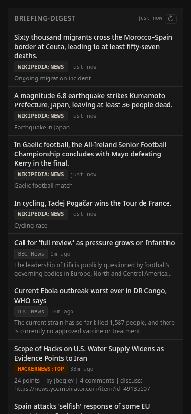

# pace

**A self-hosted dashboard for feeds, repos, papers, videos, and links.**

Pace collects content from Hacker News, RSS, GitHub, Lemmy, Mastodon, YouTube, arXiv, npm, Wikipedia, podcasts, Product Hunt, and more. You configure sources, transforms, ranking, summaries, and layout in YAML. It runs as one Bun process or Docker container, and every panel it renders is also available as JSON or RSS.

<p align="center">
  <a href="https://www.youtube.com/watch?v=UElmyC06ryM"></a>
</p>

<p align="center">
  <a href="https://www.youtube.com/watch?v=UElmyC06ryM"><strong>Watch the 2-minute demo</strong></a>
  ·
  <a href="#presets">Presets</a>
  ·
  <a href="#get-started">Get started</a>
  ·
  <a href="#share-a-snapshot">Share a snapshot</a>
  ·
  <a href="#example-dashboards">Examples</a>
</p>

## Why Pace

- **One dashboard** - combine feeds, repos, releases, papers, videos, podcasts, metrics, and hand-picked links.
- **Filtering and ranking** - filter, exclude, dedupe, time-decay, cluster, keyword-score, and optionally use an LLM to summarize, filter, merge, or rank items.
- **Flexible layout** - arrange panels, counters, markdown, images, and iframes with a recursive flexbox layout.
- **Portable output** - server-rendered HTML, SQLite storage, a JSON and RSS endpoint for every panel, and static snapshots you can export or publish through Gist.
- **Practical tooling** - `pace doctor` fetch-checks every configured source, `pace import` turns an OPML feed-reader export into a working config, and the dashboard is fully keyboard-navigable.
- **Agent-readable config** - bundled skills document setup and configuration workflows for coding agents.

## Presets

#### Preset showcase

| | | | |
|:---:|:---:|:---:|:---:|
| [](./presets/config.tech-news.yaml) | [](./presets/config.ml-ai.yaml) | [](./presets/config.daily-brief.yaml) | [](./presets/config.product-launches.yaml) |
| [`tech-news`](./presets/config.tech-news.yaml) | [`ml-ai`](./presets/config.ml-ai.yaml) | [`daily-brief`](./presets/config.daily-brief.yaml) | [`product-launches`](./presets/config.product-launches.yaml) |
| [](./presets/config.academic-papers.yaml) | [](./presets/config.release-tracker.yaml) | [](./presets/config.video-podcast.yaml) | |
| [`academic-papers`](./presets/config.academic-papers.yaml) | [`release-tracker`](./presets/config.release-tracker.yaml) | [`video-podcast`](./presets/config.video-podcast.yaml) | |

Presets are bundled in the Docker image and selectable with a single flag (`--preset tech-news` or `-P ml-ai`; see `pace --list-presets`).

Available presets:

| Preset | Focus |
|--------|-------|
| `tech-news` | Tech news: HN + Lobsters frontpage, Lemmy communities, news/blogs, releases |
| `ml-ai` | AI and machine learning: arXiv papers, local-LLM community, releases, curated blogs |
| `daily-brief` | Morning briefing: world headlines, Wikipedia in-the-news/most-read, big HN stories |
| `product-launches` | Product launches: Product Hunt, Show HN, trending repos, fresh npm packages |
| `release-tracker` | Software release tracking |
| `academic-papers` | Academic papers: arXiv, CS theory Q&A, science journalism |
| `video-podcast` | Video and podcast content |

List presets: `pace presets list` (or `pace --list-presets`).

## Get Started

### Recommended: agent skills

If you use a coding agent, install the bundled skills so it can follow the local setup commands and config schema. The skills cover installing Pace, running a preset, creating `config.yaml`, adding feeds, tuning transforms, and publishing a static snapshot.

```bash
npx skills add av/pace --skill pace-setup
npx skills add av/pace --skill pace-config
```

List all available skills: `npx skills add av/pace --list`.

Agents working inside the repo can read the same skills through the CLI:

```bash
git clone https://github.com/av/pace.git && cd pace
bun install && npm link

pace skill
pace skill pace-setup
pace skill pace-config
```

The Docker image also ships skills: `docker run --rm ghcr.io/av/pace pace skill`.

### Secondary: Docker

```bash
docker run -d -p 7453:7453 -v pace-data:/app/data ghcr.io/av/pace:latest
```

Open http://localhost:7453. Health check: `curl http://localhost:7453/health` returns `{"status":"ok"}`.

The container runs pace as the unprivileged `bun` user (uid 1000). The entrypoint starts as root only long enough to ensure `/app/data` is owned by uid 1000 (a recursive `chown` that runs only when ownership is wrong, so it happens at most once per data directory), then permanently drops privileges. To manage permissions yourself, start the container with `--user 1000:1000` — the entrypoint then skips the chown, and the data directory must already be writable by that uid.

**Upgrading:** `docker pull ghcr.io/av/pace:latest` and recreate the container (`docker compose up -d --build` for local builds). Your data survives in the `pace-data` volume. The image ships its own healthcheck; `curl` is not installed, so drop any compose/run-level `curl`-based healthcheck override — it would report a permanently unhealthy container.

### With a preset

Use `--preset` (or `-P`) with Docker or source commands, for example `--preset tech-news`. See the "## Presets" section for the full list.

### Secondary: from source

```bash
git clone https://github.com/av/pace.git && cd pace
bun install && npm link
pace serve --preset tech-news
```

Before `npm link`, use `bun run src/cli.ts ...` instead of `pace ...`.

### Secondary: your own config

```bash
curl -O https://raw.githubusercontent.com/av/pace/main/config.example.yaml
mv config.example.yaml config.yaml
# edit config.yaml
pace config check config.yaml
pace serve --config config.yaml
```

## Custom Docker Config

```bash
curl -O https://raw.githubusercontent.com/av/pace/main/config.example.yaml
mv config.example.yaml config.yaml
# edit config.yaml
docker run -d \
  -p 7453:7453 \
  -v pace-data:/app/data \
  -v ./config.yaml:/app/config.yaml:ro \
  ghcr.io/av/pace:latest
```

## Config Tools

```bash
pace config check [path]   # validate a config file
pace doctor                # fetch-check every configured source
pace import feeds.opml     # convert an OPML feed export to a pace config
```

Validate before serving: `pace config check config.yaml` catches schema errors without starting the server. To verify the configured feeds actually respond, run `pace doctor` — it fetches every source once and reports per-source ok/failure with the underlying error (exit 1 if anything failed).

Migrating from a feed reader? `pace import feeds.opml` converts an OPML export (the standard export format of Feedly, Inoreader, NewsBlur, Miniflux, etc.) into a ready-to-use config: one `rss` adapter and one panel per OPML folder (nested folders join with `` / ``; feeds outside any folder land in a "Feeds" panel). It prints YAML to stdout, or writes to a file when given a second argument — `pace import feeds.opml config.yaml`. Duplicate feeds and outlines without an `xmlUrl` are skipped with a warning, and the generated file passes `pace config check` as-is.

## Server Configuration

Port and config path come from the CLI or environment:

- `pace serve --port 8080` (or `-p 8080`), or the `PORT` env var. Default: `7453`.
- `pace serve --config config.yaml`, `--preset <name>`, or the `PACE_CONFIG` env var.
- `PACE_DB_PATH` env var overrides the SQLite database location. Default: `data/pace.db` under the working directory.

An optional top-level `server` block in `config.yaml` controls server behavior (unknown fields are rejected at validation):

```yaml
server:
  base_path: /pace     # serve the dashboard under a URL prefix (default: none)
  retention_days: 30   # days to keep fetched items in SQLite (default: 30; 0 disables pruning)
```

### `server.base_path` - reverse proxy subpath

Set `base_path` when pace runs behind a reverse proxy under a subpath (for example `https://example.com/pace/`). Pages, static assets, and refresh redirects are all generated with the prefix. The value is normalized on load: a leading `/` is added if missing and a trailing `/` is stripped (`pace/` becomes `/pace`).

Pace answers both at the prefix and at the root, so it works whether or not your proxy strips the prefix before forwarding:

```nginx
# Prefix preserved by the proxy:
location /pace/ { proxy_pass http://127.0.0.1:7453; }

# Prefix stripped by the proxy:
location /pace/ { proxy_pass http://127.0.0.1:7453/; }
```

### `server.retention_days` - item retention

Fetched items live in SQLite so panels stay populated across restarts and upstream outages. Items last fetched more than `retention_days` days ago are pruned at startup and then once every 24 hours. Set `0` to disable pruning entirely (the log notes when pruning is disabled). Must be a non-negative integer; the default is 30.

The database (`data/pace.db`) is a cache: deleting it is always safe, and contents are re-fetched on the next refresh. The schema is migrated automatically on startup when a newer pace version changes it; to downgrade across a schema change, delete the database or restore a pre-upgrade copy (see the [changelog](CHANGELOG.md) for version specifics).

### `/health` - liveness and refresh health

`GET /health` returns JSON with an overall `status` and per-source refresh detail:

```json
{
  "status": "degraded",
  "sources": [
    { "kind": "adapter", "name": "hackernews", "status": "ok", "lastSuccessAt": "2026-07-08T00:00:00.000Z", "lastDurationMs": 412, "lastItemCount": 30 },
    { "kind": "adapter", "name": "myfeed", "status": "failing", "lastError": "rss: error fetching ...", "lastFailureAt": "2026-07-08T00:05:00.000Z", "lastDurationMs": 5003 }
  ]
}
```

`status` is `degraded` when any source's latest completed run failed; per-source `status` is `ok`, `failing`, or `pending` (no run completed yet, e.g. right after startup). Per-source extras appear once available: `lastError` (message from the most recent failure), `lastDurationMs` (duration of the latest completed run, success or failure), and `lastItemCount` (items produced by the latest successful run — fetched items for adapters, gathered input items for pipelines — retained through later failures as context). The HTTP status stays `200` as long as the server is up — it serves cached data even when upstreams fail, and a restart would not fix a bad upstream — so container healthchecks keep passing while monitors can alert on the body.

### `/api/panels` - JSON panel data

The dashboard's data is also served as read-only JSON, for scripts, widgets, and monitors that want data instead of HTML.

`GET /api/panels` lists every panel with its id, display name, refresh sources, current item count, and last refresh time:

```json
{
  "panels": [
    { "id": "tech-panel", "name": "Tech", "sources": ["hackernews"], "item_count": 30, "last_refreshed_at": "2026-07-08T00:00:00Z" }
  ]
}
```

`GET /api/panels/<panel>` returns one panel's deduped items, newest first, accepting the panel id or display name (same lookup as `POST /refresh/<panel>`). Each item carries `id`, `title`, `url`, `source`, `timestamp`, `fetched_at`, `summary`, `body`, `score` (from `llm-rank`, if any), and `origins` (contributing feeds for merged items). An optional `?limit=N` (1-500) overrides the panel's configured item limit:

```bash
curl http://localhost:7453/api/panels/tech-panel?limit=5
```

Append `.rss` to the panel segment to get the same items as an RSS 2.0 feed instead of JSON, so any panel — including transform pipelines that dedupe, rank, or summarize — can feed a regular feed reader:

```bash
curl http://localhost:7453/api/panels/tech-panel.rss
```

Feed items carry the title, link, a stable non-permalink `guid`, the source feed as `category`, `pubDate`, and a `description` (the LLM summary when one exists, otherwise the item body). The same `?limit=` override applies.

Unknown panels return a JSON 404 (`{"error": "Unknown panel: ..."}`). All of these endpoints respect `server.base_path`.

## Share a Snapshot

Pace can turn the current dashboard into static files, so you can share a dashboard without exposing or operating a public pace server.

```bash
pace share export pace-share
```

That writes `pace-share/index.html` and `pace-share/styles.css` for local review or manual upload.
For email, chat, or other one-file transfers, use `pace share export pace-share --single-file`;
the resulting `index.html` includes its stylesheet and can be moved by itself.

Publish the same snapshot to GitHub Gist and get a browser-rendered URL:

```bash
GITHUB_TOKEN=... pace share gist   # GH_TOKEN works too
```

Useful options:

- `--gist-id <id>` or `--update <id>` updates an existing Gist so the share URL stays stable.
- `--public` creates a public Gist; the default is secret/unlisted.
- `--renderer-url <url>` switches from the default `https://gisthost.github.io/` renderer to another compatible Gist renderer.

Static snapshots are read-only: refresh controls, the keyboard-navigation script, and server-only routes are omitted, and unresolved environment placeholders are rejected instead of being published.

## Built-in content adapters

Pace ships with 19 adapters: `hackernews`, `rss`, `github`, `github-releases`, `lobsters`, `youtube`, `arxiv`, `mastodon`, `npm`, `wikipedia`, `lemmy`, `devto`, `stackexchange`, `producthunt`, `podcast`, `bookmarks`, `counter`, `reddit`, and `twitter`.

Use `bookmarks` for curated links that live directly in config. Use `counter` for numeric JSON endpoints rendered as stat cards. Every ingest adapter can have its own `refresh_interval`.

The full adapter table is in skills/pace-config/SKILL.md, or from the CLI:

```bash
pace adapters list            # list all adapter types
pace adapters explain <type>  # show params and example
```

### Caveats

Some adapters are listed above but do not work out of the box:

- **`reddit`** - Reddit's public unauthenticated `.json` API often returns **HTTP 403** upstream. Bundled presets intentionally omit Reddit for this reason. For community discussions without credentials, use **`lemmy`** instead (included in the `tech-news` and `ml-ai` presets).
- **`twitter`** - Requires `bearer_token` in adapter params. Without it, the adapter **always returns an empty list** (no error). Run `pace adapters explain twitter` for setup details.

## Transforms

Transforms process content after fetching - filter, deduplicate, rank, or enrich items before they reach the dashboard.

| Transform | What it does |
|-----------|-------------|
| `latest` | Keep the N most recent items |
| `filter` | Include items matching keywords |
| `exclude` | Remove items matching keywords |
| `sort` | Sort by field (score, date, title) |
| `dedupe` | Deduplicate by URL, domain, or title similarity |
| `time-decay` | Blend engagement with recency using configurable half-life |
| `keyword-score` | Score items by weighted keyword/regex matches |
| `cluster` | Group related stories across sources |
| `llm-summarize` | Summarize items with an LLM (optionally fetches full page content) |
| `llm-filter` | Keep only items matching interests, scored by LLM |
| `llm-rank` | Rank items 0-10 by relevance to your interests |
| `llm-merge` | Merge and deduplicate using LLM understanding |

`pace transforms list` shows all transform types. `pace transforms explain <type>` shows parameters and examples.

## Pipelines

Pipelines merge items from multiple adapters, then apply transforms to the combined feed. Useful for cross-source deduplication and unified ranking.

For example, one panel can merge Hacker News, Lobsters, and RSS, dedupe repeated links, rank by your interests, and summarize the winners before rendering.

## Layout

Arrange panels in a recursive flexbox tree. Each node is a flex container, a panel, or a widget.

Panels display adapters or pipelines. Widgets display static images, text/markdown, sanitized HTML, iframes, or stat-card counters. Responsive layouts collapse to a single column on mobile below 768px:

<p align="center"></p>

See skills/pace-config/SKILL.md for the layout reference.

## Keyboard Navigation

The dashboard can be driven entirely from the keyboard; pressing `?` on a running dashboard shows the same table as an overlay.

| Keys | Action |
|------|--------|
| `j / k` | Next / previous item in the panel |
| `h / l` | Previous / next panel |
| `Tab` | Move through links and buttons |
| `Enter` | Open the focused item |
| `r` | Refresh the focused panel |
| `?` | Show or hide the help overlay |
| `Esc` | Close the help overlay |

The keys come from one small script (`/dashboard.js`) served alongside the page — a progressive enhancement, not a requirement: everything stays reachable with `Tab` alone, and static snapshots ship without the script.

## LLM integration (optional)

Connect any LLM provider via [pi-ai](https://github.com/badlogic/pi-mono) to power the `llm-*` transforms. Works with OpenAI, Anthropic, Google, Groq, Mistral, and any OpenAI-compatible endpoint. Gracefully degrades when unconfigured.

Define your interests once; `llm-rank` and `llm-filter` use them by default. Without an LLM, the same adapters, transforms, layouts, and static sharing flow still work.

See skills/pace-config/SKILL.md for the llm reference.

## Example Dashboards

These are reference dashboards: useful for seeing what pace can express, studying layout patterns, and adapting a config by hand. For ready-to-run starting points, use Presets.

| | | | |
|:---:|:---:|:---:|:---:|
| [](./examples/morning-brief.yaml) | [](./examples/dev-radar.yaml) | [](./examples/indie-web.yaml) | [](./examples/open-source-launchpad.yaml) |
| [Morning Brief](./examples/morning-brief.yaml) | [Dev Radar](./examples/dev-radar.yaml) | [Indie Web](./examples/indie-web.yaml) | [Open Source Launchpad](./examples/open-source-launchpad.yaml) |
| [](./examples/release-cockpit.yaml) | [](./examples/science-desk.yaml) | [](./examples/layout-system.yaml) | [](./examples/widgets-gallery.yaml) |
| [Release Cockpit](./examples/release-cockpit.yaml) | [Science Desk](./examples/science-desk.yaml) | [Layout System](./examples/layout-system.yaml) | [Widgets Gallery](./examples/widgets-gallery.yaml) |

<p align="center">Example layouts above. Use the paths in Get Started to run pace with agent skills, Docker, or source.</p>

## For agents

See [Get Started](#get-started): humans install skills with `npx skills add av/pace`; agents clone pace and use `pace skill`. The [`examples/`](examples/) directory pairs screenshots with reference configs to study when writing `config.yaml`.

## Tech stack

Bun + Hono + SQLite + JSX server rendering. The only client-side JavaScript is the optional keyboard-navigation script; no-JS browsers and static snapshots get the same dashboard.

## License

MIT
