# pace

**A self-hosted dashboard for feeds, repos, papers, videos, and links.**

Pace collects content from Hacker News, RSS, GitHub, Lemmy, Mastodon, YouTube, arXiv, npm, Wikipedia, podcasts, Product Hunt, and more. You configure sources, transforms, ranking, summaries, and layout in YAML. It runs as one Bun process or Docker container, and every panel it renders is also available as JSON or RSS.

<p align="center">
  <a href="https://www.youtube.com/watch?v=UElmyC06ryM"></a>
</p>

<p align="center">
  <a href="https://www.youtube.com/watch?v=UElmyC06ryM"><strong>Watch the 2-minute demo</strong></a>
  ·
  <a href="#presets">Presets</a>
  ·
  <a href="#get-started">Get started</a>
  ·
  <a href="#share-a-snapshot">Share a snapshot</a>
  ·
  <a href="#example-dashboards">Examples</a>
</p>

## Why Pace

- **One dashboard** - combine feeds, repos, releases, papers, videos, podcasts, metrics, and hand-picked links.
- **Filtering and ranking** - filter, exclude, dedupe, time-decay, cluster, keyword-score, and optionally use an LLM to summarize, filter, merge, or rank items.
- **Flexible layout** - arrange panels, counters, markdown, images, and iframes with a recursive flexbox layout.
- **Portable output** - server-rendered HTML, SQLite storage, a JSON and RSS endpoint for every panel, webhook notifications for high-signal items, and static snapshots you can export or publish through Gist.
- **Practical tooling** - `pace doctor` fetch-checks every configured source, `pace import` / `pace export` convert between OPML feed-reader exports and pace configs in both directions, and the dashboard is fully keyboard-navigable.
- **Agent-readable config** - bundled skills document setup and configuration workflows for coding agents.

## Presets

#### Preset showcase

| | | | |
|:---:|:---:|:---:|:---:|
| [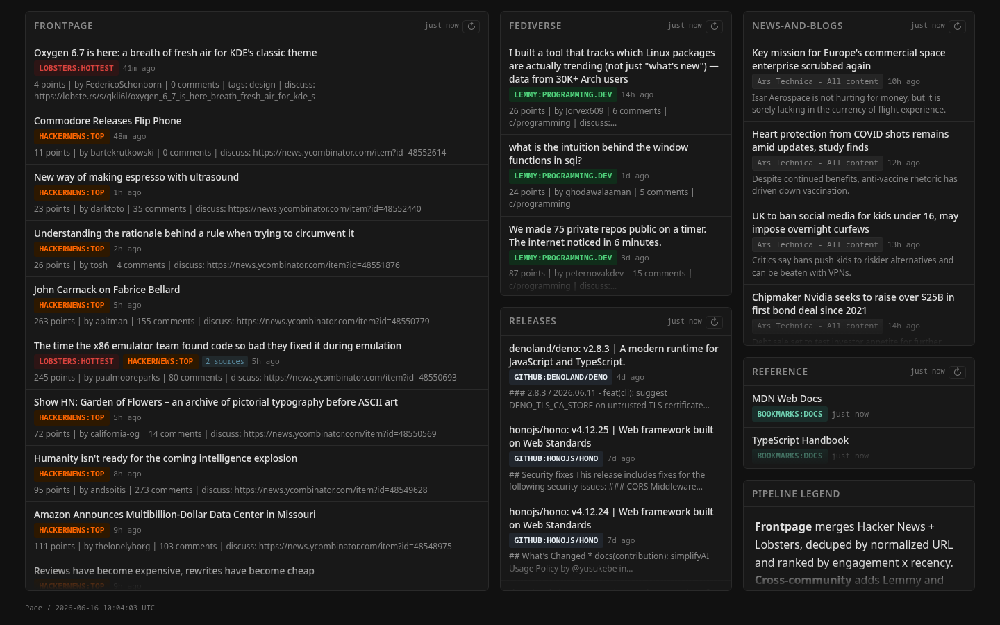](./presets/config.tech-news.yaml) | [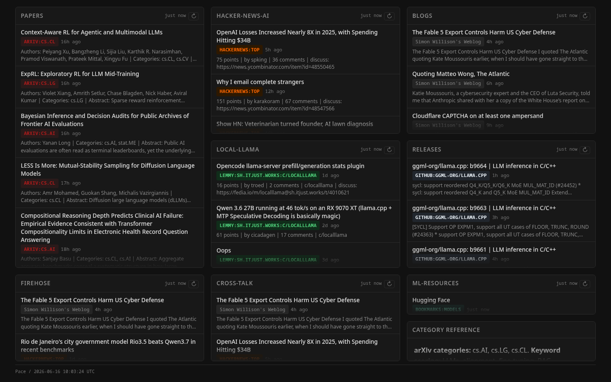](./presets/config.ml-ai.yaml) | [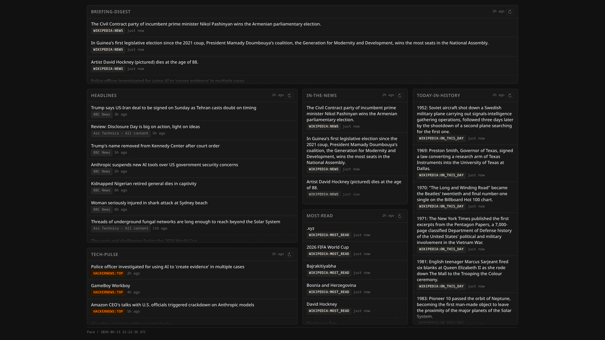](./presets/config.daily-brief.yaml) | [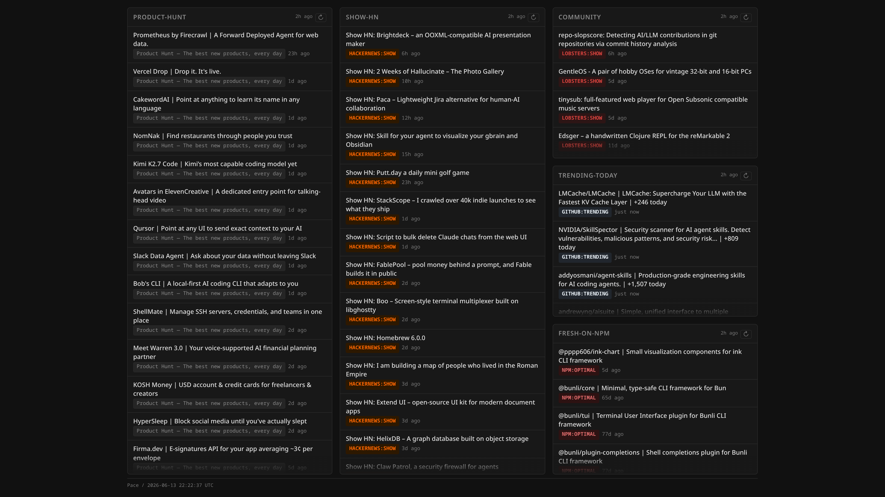](./presets/config.product-launches.yaml) |
| [`tech-news`](./presets/config.tech-news.yaml) | [`ml-ai`](./presets/config.ml-ai.yaml) | [`daily-brief`](./presets/config.daily-brief.yaml) | [`product-launches`](./presets/config.product-launches.yaml) |
| [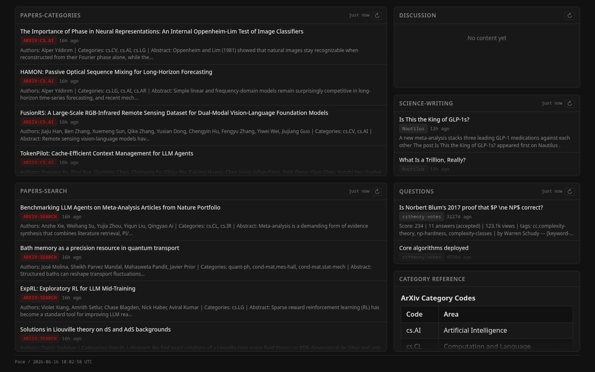](./presets/config.academic-papers.yaml) | [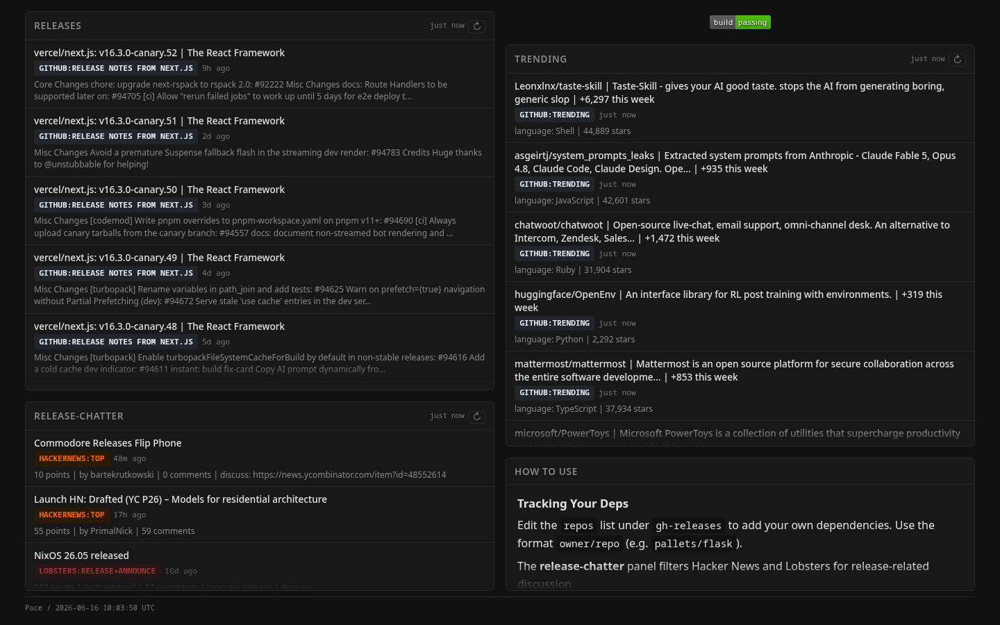](./presets/config.release-tracker.yaml) | [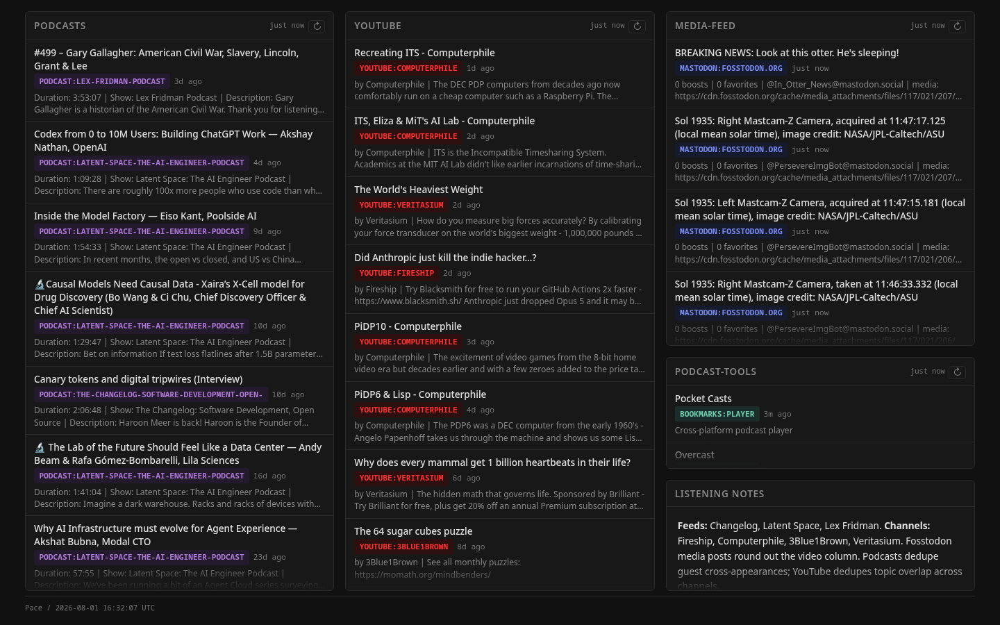](./presets/config.video-podcast.yaml) | |
| [`academic-papers`](./presets/config.academic-papers.yaml) | [`release-tracker`](./presets/config.release-tracker.yaml) | [`video-podcast`](./presets/config.video-podcast.yaml) | |

Presets are bundled in the Docker image and selectable with a single flag (`--preset tech-news` or `-P ml-ai`; see `pace --list-presets`).

Available presets:

| Preset | Focus |
|--------|-------|
| `tech-news` | Tech news: HN + Lobsters frontpage, Lemmy communities, news/blogs, releases |
| `ml-ai` | AI and machine learning: arXiv papers, local-LLM community, releases, curated blogs |
| `daily-brief` | Morning briefing: world headlines, Wikipedia in-the-news/most-read, big HN stories |
| `product-launches` | Product launches: Product Hunt, Show HN, trending repos, fresh npm packages |
| `release-tracker` | Software release tracking |
| `academic-papers` | Academic papers: arXiv, CS theory Q&A, science journalism |
| `video-podcast` | Video and podcast content |

List presets: `pace presets list` (or `pace --list-presets`).

## Get Started

### Recommended: agent skills

If you use a coding agent, install the bundled skills so it can follow the local setup commands and config schema. The skills cover installing Pace, running a preset, creating `config.yaml`, adding feeds, tuning transforms, and publishing a static snapshot.

```bash
npx skills add av/pace --skill pace-setup
npx skills add av/pace --skill pace-config
```

List all available skills: `npx skills add av/pace --list`.

Agents working inside the repo can read the same skills through the CLI:

```bash
git clone https://github.com/av/pace.git && cd pace
bun install && npm link

pace skill
pace skill pace-setup
pace skill pace-config
```

The Docker image also ships skills: `docker run --rm ghcr.io/av/pace pace skill`.

### Secondary: Docker

```bash
docker run -d -p 7453:7453 -v pace-data:/app/data ghcr.io/av/pace:latest
```

Open http://localhost:7453. Health check: `curl http://localhost:7453/health` returns `{"status":"ok"}`.

The container runs pace as the unprivileged `bun` user (uid 1000). The entrypoint starts as root only long enough to ensure `/app/data` is owned by uid 1000 (a recursive `chown` that runs only when ownership is wrong, so it happens at most once per data directory), then permanently drops privileges. To manage permissions yourself, start the container with `--user 1000:1000` — the entrypoint then skips the chown, and the data directory must already be writable by that uid.

**Upgrading:** `docker pull ghcr.io/av/pace:latest` and recreate the container (`docker compose up -d --build` for local builds). Your data survives in the `pace-data` volume. The image ships its own healthcheck; `curl` is not installed, so drop any compose/run-level `curl`-based healthcheck override — it would report a permanently unhealthy container.

### With a preset

Use `--preset` (or `-P`) with Docker or source commands, for example `--preset tech-news`. See the "## Presets" section for the full list.

### Secondary: from source

```bash
git clone https://github.com/av/pace.git && cd pace
bun install && npm link
pace serve --preset tech-news
```

Before `npm link`, use `bun run src/cli.ts ...` instead of `pace ...`.

### Secondary: your own config

```bash
curl -O https://raw.githubusercontent.com/av/pace/main/config.example.yaml
mv config.example.yaml config.yaml
# edit config.yaml
pace config check config.yaml
pace serve --config config.yaml
```

## Custom Docker Config

```bash
curl -O https://raw.githubusercontent.com/av/pace/main/config.example.yaml
mv config.example.yaml config.yaml
# edit config.yaml
docker run -d \
  -p 7453:7453 \
  -v pace-data:/app/data \
  -v ./config.yaml:/app/config.yaml:ro \
  ghcr.io/av/pace:latest
```

## Config Tools

```bash
pace config check [path]   # validate a config file
pace doctor                # fetch-check every configured source
pace import feeds.opml     # convert an OPML feed export to a pace config
pace export feeds.opml     # export configured feed URLs as OPML
pace notify test           # send a test delivery to notify webhooks
```

Validate before serving: `pace config check config.yaml` catches schema errors without starting the server. To verify the configured feeds actually respond, run `pace doctor` — it fetches every source once and reports per-source ok/failure with the underlying error (exit 1 if anything failed).

Migrating from a feed reader? `pace import feeds.opml` converts an OPML export (the standard export format of Feedly, Inoreader, NewsBlur, Miniflux, etc.) into a ready-to-use config: one `rss` adapter and one panel per OPML folder (nested folders join with `` / ``; feeds outside any folder land in a "Feeds" panel). It prints YAML to stdout, or writes to a file when given a second argument — `pace import feeds.opml config.yaml`. Duplicate feeds and outlines without an `xmlUrl` are skipped with a warning, and the generated file passes `pace config check` as-is.

Going the other way, `pace export` writes the feed URLs from the active config (`--config`/`--preset` work as usual) as an OPML 2.0 file any feed reader can import: one folder per `rss` or `podcast` adapter, one outline per URL. It prints OPML to stdout or writes to a file when given a path — `pace export feeds.opml`. Adapters without feed URLs (hackernews, github, arxiv, ...) are skipped with a warning, and the output round-trips through `pace import`.

## Server Configuration

Port and config path come from the CLI or environment:

- `pace serve --port 8080` (or `-p 8080`), or the `PORT` env var. Default: `7453`.
- `pace serve --config config.yaml`, `--preset <name>`, or the `PACE_CONFIG` env var.
- `PACE_DB_PATH` env var overrides the SQLite database location. Default: `data/pace.db` under the working directory.

An optional top-level `server` block in `config.yaml` controls server behavior (unknown fields are rejected at validation):

```yaml
server:
  base_path: /pace     # serve the dashboard under a URL prefix (default: none)
  retention_days: 30   # days to keep fetched items in SQLite (default: 30; 0 disables pruning)
```

### `server.base_path` - reverse proxy subpath

Set `base_path` when pace runs behind a reverse proxy under a subpath (for example `https://example.com/pace/`). Pages, static assets, and refresh redirects are all generated with the prefix. The value is normalized on load: a leading `/` is added if missing and a trailing `/` is stripped (`pace/` becomes `/pace`).

Pace answers both at the prefix and at the root, so it works whether or not your proxy strips the prefix before forwarding:

```nginx
# Prefix preserved by the proxy:
location /pace/ { proxy_pass http://127.0.0.1:7453; }

# Prefix stripped by the proxy:
location /pace/ { proxy_pass http://127.0.0.1:7453/; }
```

### `server.retention_days` - item retention

Fetched items live in SQLite so panels stay populated across restarts and upstream outages. Items last fetched more than `retention_days` days ago are pruned at startup and then once every 24 hours. Set `0` to disable pruning entirely (the log notes when pruning is disabled). Must be a non-negative integer; the default is 30.

The database (`data/pace.db`) is a cache: deleting it is always safe, and contents are re-fetched on the next refresh. The schema is migrated automatically on startup when a newer pace version changes it; to downgrade across a schema change, delete the database or restore a pre-upgrade copy (see the [changelog](CHANGELOG.md) for version specifics).

### `/health` - liveness and refresh health

`GET /health` returns JSON with an overall `status` and per-source refresh detail:

```json
{
  "status": "degraded",
  "sources": [
    { "kind": "adapter", "name": "hackernews", "status": "ok", "lastSuccessAt": "2026-07-08T00:00:00.000Z", "lastDurationMs": 412, "lastItemCount": 30 },
    { "kind": "adapter", "name": "myfeed", "status": "failing", "lastError": "rss: error fetching ...", "lastFailureAt": "2026-07-08T00:05:00.000Z", "lastDurationMs": 5003 }
  ]
}
```

`status` is `degraded` when any source's latest completed run failed; per-source `status` is `ok`, `failing`, or `pending` (no run completed yet, e.g. right after startup). Per-source extras appear once available: `lastError` (message from the most recent failure), `lastDurationMs` (duration of the latest completed run, success or failure), and `lastItemCount` (items produced by the latest successful run — fetched items for adapters, gathered input items for pipelines — retained through later failures as context). The HTTP status stays `200` as long as the server is up — it serves cached data even when upstreams fail, and a restart would not fix a bad upstream — so container healthchecks keep passing while monitors can alert on the body.

### `/api/panels` - JSON panel data

The dashboard's data is also served as read-only JSON, for scripts, widgets, and monitors that want data instead of HTML.

`GET /api/panels` lists every panel with its id, display name, refresh sources, current item count, and last refresh time:

```json
{
  "panels": [
    { "id": "tech-panel", "name": "Tech", "sources": ["hackernews"], "item_count": 30, "last_refreshed_at": "2026-07-08T00:00:00Z" }
  ]
}
```

`GET /api/panels/<panel>` returns one panel's deduped items, newest first, accepting the panel id or display name (same lookup as `POST /refresh/<panel>`). Each item carries `id`, `title`, `url`, `source`, `timestamp`, `fetched_at`, `summary`, `body`, `score` (from `llm-rank`, if any), and `origins` (contributing feeds for merged items). An optional `?limit=N` (1-500) overrides the panel's configured item limit:

```bash
curl http://localhost:7453/api/panels/tech-panel?limit=5
```

Append `.rss` to the panel segment to get the same items as an RSS 2.0 feed instead of JSON, so any panel — including transform pipelines that dedupe, rank, or summarize — can feed a regular feed reader:

```bash
curl http://localhost:7453/api/panels/tech-panel.rss
```

Feed items carry the title, link, a stable non-permalink `guid`, the source feed as `category`, `pubDate`, and a `description` (the LLM summary when one exists, otherwise the item body). The same `?limit=` override applies.

`GET /api/search?q=<terms>` searches every stored item — everything in the database, not just what the dashboard currently renders — for items matching **all** whitespace-separated terms, case-insensitively, in the title, URL, source, summary, or body (the same semantics as the dashboard's `/` filter bar). Results are the same deduped items the panel API serves, newest first, each carrying an extra `panel` field naming the panel it lives on. A `starred:yes` or `starred:no` term filters by star state instead of matching text (`q=starred:yes` alone lists everything you've starred), and `seen:yes` / `seen:no` does the same for read state — `q=rust seen:no` finds only the Rust stories you haven't read yet, and the two operators combine. Optional `?panel=<id-or-name>` scopes the search to one panel, and `?limit=N` (1-500, default 50) caps the result count:

```bash
curl 'http://localhost:7453/api/search?q=rust+wasm&limit=10'
```

`GET /api/search.rss?q=<terms>` is the same search rendered as an RSS 2.0 feed — subscribe to any query as a **saved search** in a regular feed reader and new matches from any source show up there. Same term semantics, `?panel=` scoping, and `?limit=` cap as the JSON endpoint; the channel is titled after the query and the feed's self link keeps the query string, since that is the feed's identity. The dashboard's `/` filter bar links every non-empty query here (the **RSS** link), so a filter you keep typing is one click from becoming a feed:

```bash
curl 'http://localhost:7453/api/search.rss?q=rust+wasm'
```

### `/api/seen` - read state

`GET /api/seen` lists the keys of every item marked seen (pressing `x` on the dashboard), and `POST /api/seen` with `{"key": "...", "seen": true}` sets or clears one mark — or `{"keys": ["...", "..."], "seen": true}` sets or clears up to 500 marks atomically (pressing `a` marks a whole panel this way). Keys are the item's dedup identity — the normalized URL, or the item id when there is no URL — so marking a story seen covers its copies on every panel. Seen state lives in the server's SQLite database, shared by every browser that opens the dashboard, and marks age out with `server.retention_days` once no stored item carries the key:

```bash
curl http://localhost:7453/api/seen
```

### `/api/star` - starred items

`GET /api/star` lists the keys of every starred item (pressing `s` on the dashboard), and `POST /api/star` with `{"key": "...", "starred": true}` sets or clears one star — the same dedup-identity keys as `/api/seen`, so a star covers a story's copies on every panel. `GET /api/star.rss` serves the starred items themselves as an RSS 2.0 feed, most recently starred first — your reading list of pinned stories, subscribable from any feed reader or fetchable as portable XML (`?limit=N`, 1-500, caps it). Each entry appears once no matter how many panels carry a copy, and a star whose item has aged out of retention simply drops from the feed until the story returns:

```bash
curl http://localhost:7453/api/star.rss
```

Unknown panels return a JSON 404 (`{"error": "Unknown panel: ..."}`). All of these endpoints respect `server.base_path`.

## Share a Snapshot

Pace can turn the current dashboard into static files, so you can share a dashboard without exposing or operating a public pace server.

```bash
pace share export pace-share
```

That writes `pace-share/index.html` and `pace-share/styles.css` for local review or manual upload.
For email, chat, or other one-file transfers, use `pace share export pace-share --single-file`;
the resulting `index.html` includes its stylesheet and can be moved by itself.
Exported pages follow the viewer's OS light/dark preference (`prefers-color-scheme`) with the same palettes the interactive theme toggle uses — no JavaScript required.

Publish the same snapshot to GitHub Gist and get a browser-rendered URL:

```bash
GITHUB_TOKEN=... pace share gist   # GH_TOKEN works too
```

Useful options:

- `--gist-id <id>` or `--update <id>` updates an existing Gist so the share URL stays stable.
- `--public` creates a public Gist; the default is secret/unlisted.
- `--renderer-url <url>` switches from the default `https://gisthost.github.io/` renderer to another compatible Gist renderer.

Static snapshots are read-only: refresh controls, the keyboard-navigation script, and server-only routes are omitted, and unresolved environment placeholders are rejected instead of being published.

## Built-in content adapters

Pace ships with 19 adapters: `hackernews`, `rss`, `github`, `github-releases`, `lobsters`, `youtube`, `arxiv`, `mastodon`, `npm`, `wikipedia`, `lemmy`, `devto`, `stackexchange`, `producthunt`, `podcast`, `bookmarks`, `counter`, `reddit`, and `twitter`.

Use `bookmarks` for curated links that live directly in config. Use `counter` for numeric JSON endpoints rendered as stat cards. Every ingest adapter can have its own `refresh_interval`.

The full adapter table is in skills/pace-config/SKILL.md, or from the CLI:

```bash
pace adapters list            # list all adapter types
pace adapters explain <type>  # show params and example
```

### Caveats

Some adapters are listed above but do not work out of the box:

- **`reddit`** - Reddit's public unauthenticated `.json` API often returns **HTTP 403** upstream. Bundled presets intentionally omit Reddit for this reason. For community discussions without credentials, use **`lemmy`** instead (included in the `tech-news` and `ml-ai` presets).
- **`twitter`** - Requires `bearer_token` in adapter params. Without it, the adapter **always returns an empty list** (no error). Run `pace adapters explain twitter` for setup details.

## Transforms

Transforms process content after fetching - filter, deduplicate, rank, or enrich items before they reach the dashboard.

| Transform | What it does |
|-----------|-------------|
| `latest` | Keep the N most recent items |
| `filter` | Include items matching keywords |
| `exclude` | Remove items matching keywords |
| `sort` | Sort by field (score, date, title) |
| `dedupe` | Deduplicate by URL, domain, or title similarity |
| `time-decay` | Blend engagement with recency using configurable half-life |
| `keyword-score` | Score items by weighted keyword/regex matches |
| `cluster` | Group related stories across sources |
| `llm-summarize` | Summarize items with an LLM (optionally fetches full page content) |
| `llm-filter` | Keep only items matching interests, scored by LLM |
| `llm-rank` | Rank items 0-10 by relevance to your interests |
| `llm-merge` | Merge and deduplicate using LLM understanding |

`pace transforms list` shows all transform types. `pace transforms explain <type>` shows parameters and examples.

## Pipelines

Pipelines merge items from multiple adapters, then apply transforms to the combined feed. Useful for cross-source deduplication and unified ranking.

For example, one panel can merge Hacker News, Lobsters, and RSS, dedupe repeated links, rank by your interests, and summarize the winners before rendering.

## Webhook Notifications

Pace can push high-signal items to any webhook as they arrive, so the best of your feeds finds you between dashboard visits. Add top-level `notify:` rules; after every refresh, new items on the refreshed panels that match a rule are POSTed as JSON to its URL:

```yaml
notify:
  - url: https://ntfy.sh/my-pace-alerts   # https, or http on localhost
    name: high-signal                     # optional label used in the payload and logs
    min_score: 8                          # only items ranked at/above this (llm-rank / keyword-score)
    keywords: [rust, wasm]                # and/or: any keyword in title/body/summary (case-insensitive)
    panels: [tech-feed]                   # optional: restrict to these panel ids
    format: ntfy                          # optional delivery format: json (default), ntfy, discord, slack, template
    # template: "ALERT {{matched}}: {{items}}"  # custom body, required with format: template
    # item_template: "{{title}} — {{url}}"      # optional per-item line for {{items}}
    headers:                              # optional extra HTTP headers, e.g. auth
      Authorization: Bearer ${NTFY_TOKEN} # ${VAR} env expansion keeps tokens out of the file
```

Each rule needs `min_score` and/or `keywords` (when both are set, both must match). The default delivery body is `{"rule": "...", "matched": N, "items": [...]}` with the newest 20 matches at most; each item carries `title`, `url`, `source`, `panel`, `timestamp`, `score`, and `summary`. Every item notifies at most once per rule: the ledger lives in SQLite keyed by the item's dedup identity, so cross-panel duplicates and re-fetches never re-notify, failed deliveries (non-2xx, or a 10s timeout) are retried on the next refresh, and ledger entries age out with `server.retention_days` alongside the items they cover. Pairs well with `llm-rank` pipelines: score your merged feeds against your interests, then get pinged only above your threshold.

Set `format` to skip the translation shim for popular services: `ntfy` posts plain text with ntfy's title and click-to-open headers, `discord` posts a Discord-webhook markdown message (kept under Discord's 2000-character limit by folding overflow into an "…and N more" line), and `slack` posts a Slack incoming-webhook mrkdwn message with clickable links. When no preset fits, `format: template` posts the rule's own `template` string with `{{placeholder}}` substitution — `{{rule}}` (label), `{{matched}}` (count), `{{headline}}` (the standard one-line summary), and `{{items}}` (plain-text bullet list, overflow folded into an "…and N more" line); an optional `item_template` reshapes `{{items}}` into one rendered line per item — `{{title}}`, `{{url}}`, `{{source}}`, `{{score}}` (empty when unscored), and `{{meta}}` ("source" / "source, score N") substituted per item, the overflow line kept — so the item list itself can match the receiving service's syntax. Every placeholder in both templates also has a `{{name_json}}` twin that substitutes a JSON literal — strings escaped and quoted, `{{matched_json}}` a bare number, `{{score_json}}` a number or `null` — so a template like `{"text": {{headline_json}}}` stays valid JSON no matter what quotes or newlines a feed title carries; `{{items_json_array}}` goes further and substitutes the matched items as a real JSON array of item objects (the same shape the `json` format sends), for receivers that want structured items instead of a text blob — and takes an optional field selection, `{{items_json_array:title,url,score}}`, that narrows each object to just the listed fields in the listed order (say, dropping the bulky `summary`). Unknown placeholders in either template fail `pace config check` up front, and since you own the body there, `template` rules may also set a custom `Content-Type` header (say `application/json` for a service expecting a JSON envelope). Format is presentation only — it never changes what a rule matches or the at-most-once ledger, so you can switch formats freely without re-notifying.

Endpoints that need authentication get it via a rule's optional `headers` map: every delivery (and `pace notify test`) sends them, merged over the format preset's own headers with yours winning case-insensitively — `Content-Type` excepted, which the format owns (unless `format: template`, where the body is yours). Use `${VAR}` env expansion to keep tokens out of the config file. Header values are validated at config load (real header-name tokens, no newlines), and headers — like `format` and `name` — never affect the delivery ledger, so rotating a token never re-notifies.

Verify your endpoints with `pace notify test` — it sends a sample delivery (same payload shape, clearly marked as a test in its title and summary) to every configured rule, or just one with `pace notify test <rule-name>`, without touching the at-most-once delivery ledger. Exits non-zero when any delivery fails, so you find out about a broken webhook now instead of when a high-signal item silently disappears.

## Layout

Arrange panels in a recursive flexbox tree. Each node is a flex container, a panel, or a widget.

Panels display adapters or pipelines. Widgets display static images, text/markdown, sanitized HTML, iframes, or stat-card counters. Responsive layouts collapse to a single column on mobile below 768px:

<p align="center">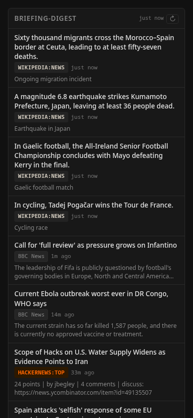</p>

See skills/pace-config/SKILL.md for the layout reference.

## Keyboard Navigation

The dashboard can be driven entirely from the keyboard; pressing `?` on a running dashboard shows the same table as an overlay.

| Keys | Action |
|------|--------|
| `j / k` | Next / previous item in the panel |
| `h / l` | Previous / next panel |
| `Tab` | Move through links and buttons |
| `Enter` | Open the focused item (marks it seen) |
| `r` | Refresh the focused panel |
| `c` | Collapse or expand the focused panel (remembered per browser) |
| `C` | Collapse all panels, or expand them all when everything is collapsed (Shift+c) |
| `t` | Toggle light / dark theme (follows the OS preference until toggled; remembered per browser). Native browser UI — form controls, classic scrollbars, the overscroll background — follows the active theme via CSS `color-scheme`, and mobile browser chrome (address bar, task switcher) follows it via `theme-color` |
| `x` | Mark the focused item seen / unseen (dimmed; persisted server-side, shared across browsers) |
| `a` | Mark the whole panel seen / unseen (all items at once; persisted server-side) |
| `s` | Star / unstar the focused item (accent ★ after the title; persisted server-side, shared across browsers). Starred items are exempt from hide-seen and seen dimming, so kept stories never vanish |
| `X` | Hide / show seen items across all panels (Shift+x; remembered per browser) |
| `S` | Show only starred items across all panels (Shift+s; remembered per browser). Panels with nothing starred dim so your pinned stories stand out |
| `/` | Filter items across panels (the bar links the query as an RSS saved search) |
| `?` | Show or hide the help overlay |
| `Esc` | Close the help overlay |

The collapse and seen actions are also clickable: each panel header gains a collapse chevron, a mark-all-seen button next to refresh, and an unseen-count badge beside the title showing how many items you haven't read yet (it disappears once the panel is fully caught up), and hovering an item reveals mark-seen and star buttons in its corner (always visible on touch screens). Starring (`s` or the ★ button) pins a story you want to keep: it gets an accent star after its title, stays at full opacity even when read, and hide-seen mode never hides it — stars persist server-side (GET/POST `/api/star`) keyed by the same dedup identity as seen marks, so a story starred on one panel is starred everywhere and survives retention pruning — and the starred list itself is a subscribable RSS feed at `/api/star.rss`. `Shift+S` (or the toolbar ★ button) flips the whole dashboard into a starred-only view — every unstarred item disappears and panels with nothing starred dim, turning your pins into a reading list; toggle it off (or press it again) to bring everything back, and your choice is remembered per browser. A small toolbar fixed in the top-right corner mirrors the page-wide keys — theme toggle (`t`), hide/show seen items (`Shift+X`, with a badge counting how many items are currently hidden), the starred-only view (`Shift+S`), the item filter (`/`, handy on touch screens where the filter would otherwise be unreachable), and the help overlay (`?`) — so a mouse or touch user can reach every dashboard action without the keyboard. Opening an item — `Enter`, click, or middle-click on its title — automatically marks it seen, so the read-tracking keeps itself up to date as you browse; `x` still un-marks anything you want to keep unread. Prefer fully manual read-tracking? Set `server: { auto_mark_seen: false }` in your config and opening an item leaves it unread — only `x`, `a`, and the mark-seen buttons change read state. Individual panels can override the page-wide default in either direction with their own `auto_mark_seen: true`/`false` in the layout — say, a "to-read list" panel that stays manual while the rest of the dashboard marks on open. Want the dashboard to open on unread items only? Set `server: { hide_seen: true }` and hide-seen mode starts on for first-time visitors — your own `Shift+X` toggle is remembered per browser and always wins over the config default. Individual panels can opt out of (or into) hiding with their own `hide_seen: true`/`false` in the layout: a hand-picked "to-read list" panel with `hide_seen: false` keeps showing its read items while `Shift+X` clears the rest of the page, and a high-volume firehose panel with `hide_seen: true` always shows only unread items no matter the toggle. The browser-tab title mirrors the page's unread total, email style — `(12) pace` — counting each story once even when it appears on several panels, and returning to the plain title once you're caught up, so a background tab tells you at a glance whether anything new is waiting. The favicon matches: the pace monogram icon (served at `/favicon.svg`, and embedded self-contained in static exports) gains an unread dot while anything is unseen — showing the count itself while it's a single digit — and drops it once you're caught up — legible even when tabs are too narrow to show titles.

The dashboard is also installable as an app: it serves a web app manifest (`/manifest.webmanifest`), so Android's "Add to Home screen", desktop Chrome/Edge "Install", and iOS Safari's share sheet turn it into a standalone home-screen app with the pace icon and dark splash — with `server.base_path`, each pace instance on the origin installs as its own app. A lightweight service worker (`/sw.js`, registered by the dashboard script) keeps the last-rendered dashboard viewable offline: every page load refreshes the cache network-first, so when the server is unreachable — laptop offline, pace host down — you still get the most recent render instead of a browser error page, and its presence makes Chrome offer its full install prompt. While the browser is offline, a banner at the top of the page says so — naming the timestamp of the render you're looking at — and disappears the moment the network returns, so a cached copy is never mistaken for live data. The banner's "Retry now" button re-attempts a live load with one click — useful when the connection is back but the browser never fired an `online` event (captive portals, a briefly down pace host).

The keys and buttons come from one small script (`/dashboard.js`) served alongside the page — a progressive enhancement, not a requirement: everything stays reachable with `Tab` alone, and static snapshots ship without the script.

## LLM integration (optional)

Connect any LLM provider via [pi-ai](https://github.com/badlogic/pi-mono) to power the `llm-*` transforms. Works with OpenAI, Anthropic, Google, Groq, Mistral, and any OpenAI-compatible endpoint. Gracefully degrades when unconfigured.

Define your interests once; `llm-rank` and `llm-filter` use them by default. Without an LLM, the same adapters, transforms, layouts, and static sharing flow still work.

See skills/pace-config/SKILL.md for the llm reference.

## Example Dashboards

These are reference dashboards: useful for seeing what pace can express, studying layout patterns, and adapting a config by hand. For ready-to-run starting points, use Presets.

| | | | |
|:---:|:---:|:---:|:---:|
| [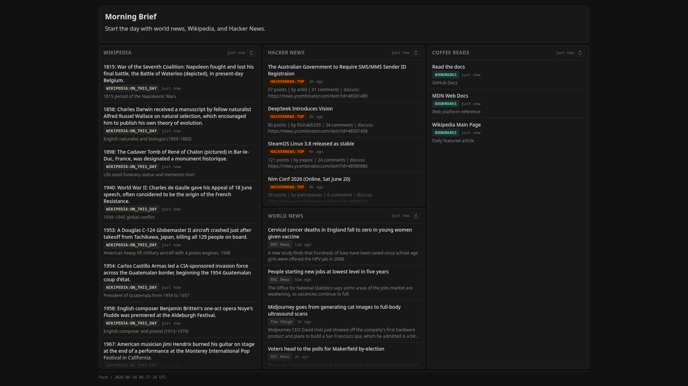](./examples/morning-brief.yaml) | [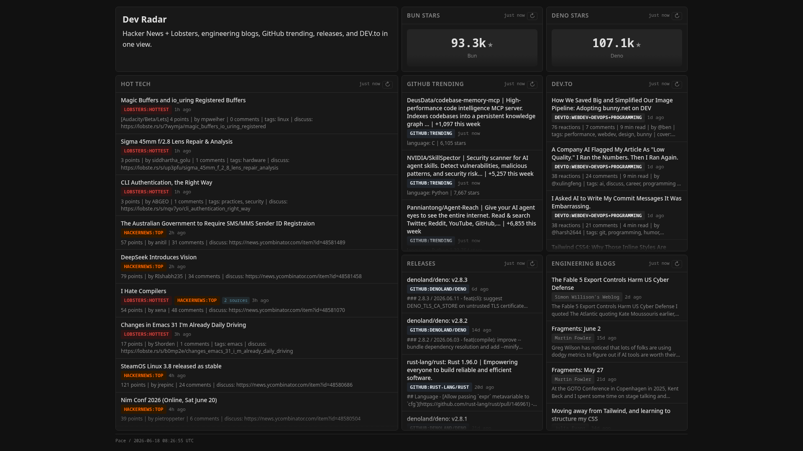](./examples/dev-radar.yaml) | [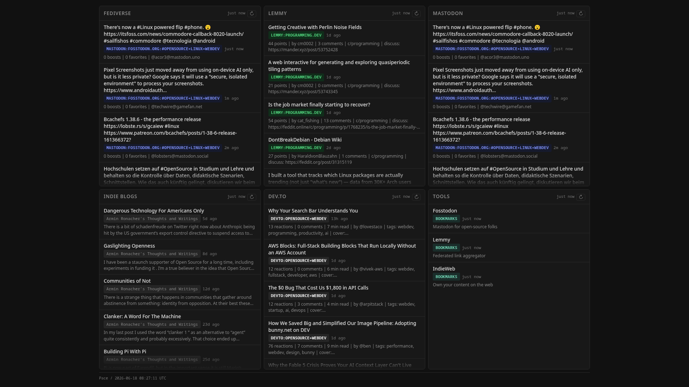](./examples/indie-web.yaml) | [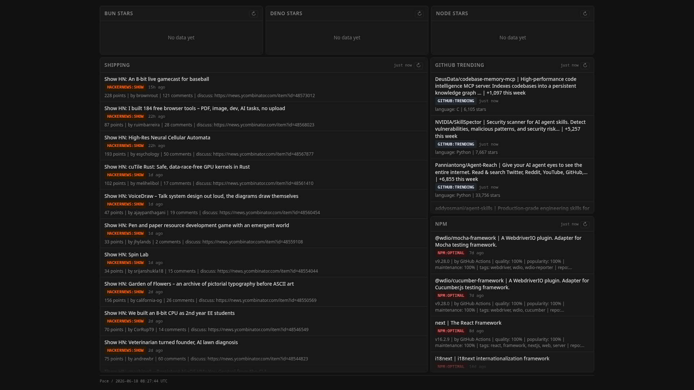](./examples/open-source-launchpad.yaml) |
| [Morning Brief](./examples/morning-brief.yaml) | [Dev Radar](./examples/dev-radar.yaml) | [Indie Web](./examples/indie-web.yaml) | [Open Source Launchpad](./examples/open-source-launchpad.yaml) |
| [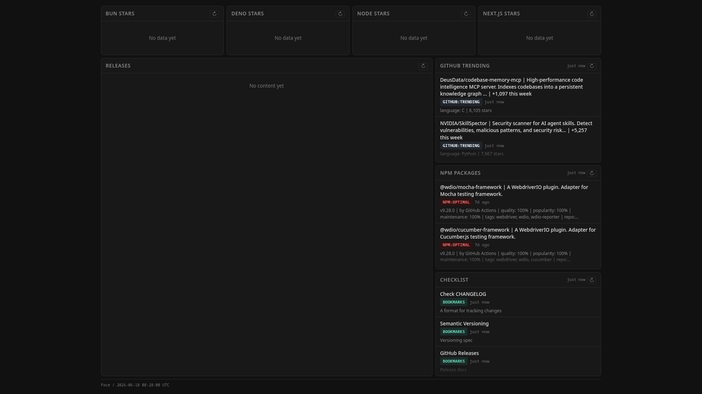](./examples/release-cockpit.yaml) | [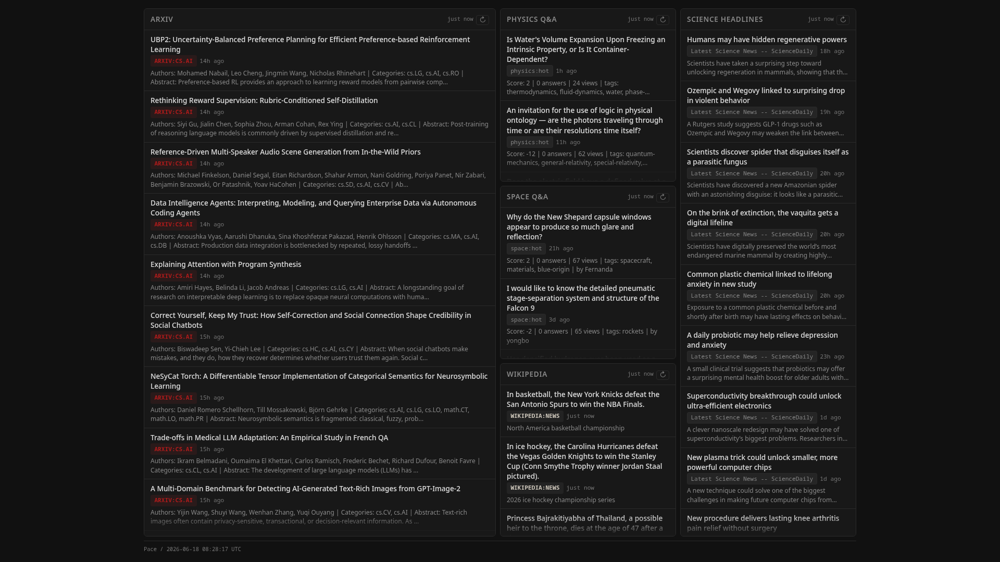](./examples/science-desk.yaml) | [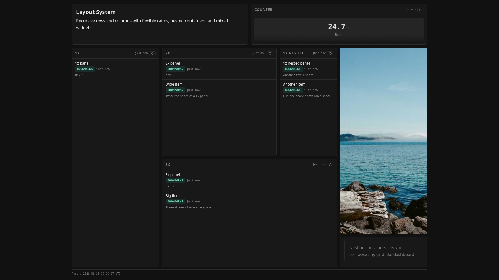](./examples/layout-system.yaml) | [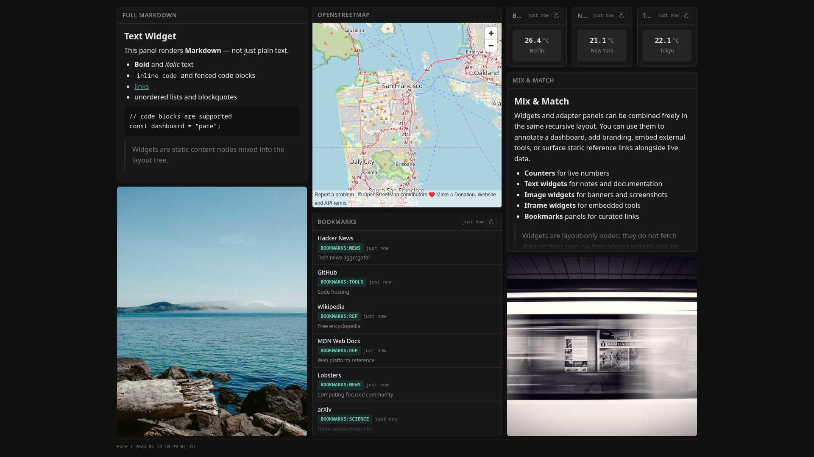](./examples/widgets-gallery.yaml) |
| [Release Cockpit](./examples/release-cockpit.yaml) | [Science Desk](./examples/science-desk.yaml) | [Layout System](./examples/layout-system.yaml) | [Widgets Gallery](./examples/widgets-gallery.yaml) |

<p align="center">Example layouts above. Use the paths in Get Started to run pace with agent skills, Docker, or source.</p>

## For agents

See [Get Started](#get-started): humans install skills with `npx skills add av/pace`; agents clone pace and use `pace skill`. The [`examples/`](examples/) directory pairs screenshots with reference configs to study when writing `config.yaml`.

## Tech stack

Bun + Hono + SQLite + JSX server rendering. The only client-side JavaScript is the optional keyboard-navigation script; no-JS browsers and static snapshots get the same dashboard.

## License

MIT
